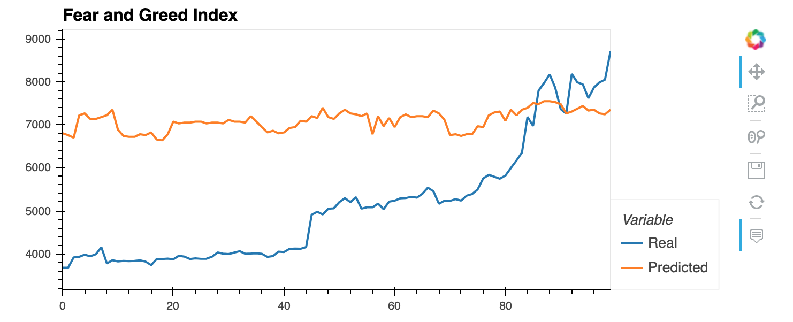
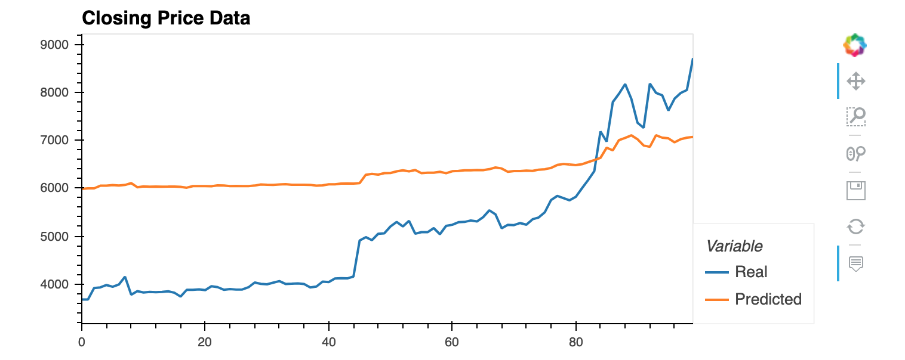

# Analysis of Closing Prices and Fear and Greed Index using LSTM 

## Closing Price Data (Window = 1, number of units = 30, optimizer = adam, loss = mean squared error)
* Accuracy = 0.0061
* Loss = 0.0294

## Fear and Greed Index Data (Window = 1, number of units = 30, optimizer = adam, loss = mean squared error)
* Accuracy = 0.0000e+00
* Loss = 0.1098

### Which model has a lower loss?
* Closing Price model as a feature column

### Which model tracks the actual values better over time?
* Closing Price model tracks the values very well but the accuracy score doesn't imply that

### Which window size works best for the model?
* Window size of 1 works the best, fits the spikes and declines more accurately