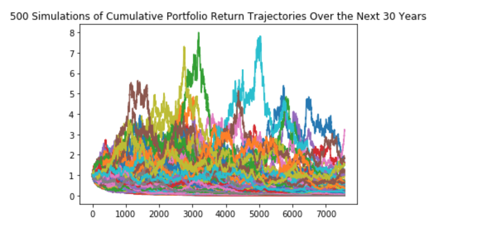

# Monte Carlo Simulation: 30 Year Outlook of 40% AGG and 60% SPY

# 500 simulations a projection for potential cumulative returns on a 20,000 dollar initial investment:
 
 There is a 90 percent chance that an initial investment of 20,000 dollars in the portfolio over the next 30 years will end within in the range of 20072.13 dollars and 24338.42 dollars
 
 
 
 