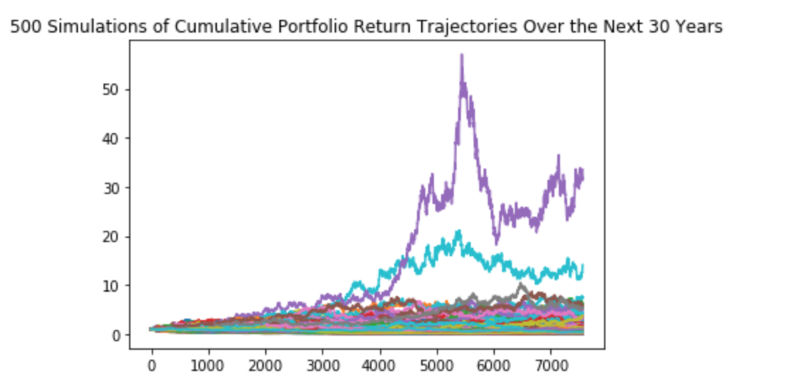

# Monte Carlo Simulation: 30 Year Outlook of 40% AGG and 60% SPY

# 500 simulations a projection for potential cumulative returns on a 20,000 dollar initial investment over the course of 30 years:
 
* There is a 90% chance that an initial investment of 20,000 dollars in the portfolio over the next 30 years will end within in the range of 25429.08 dollars and 44170.94 dollars

 
 
 
 
 
 
 
 
 # At a 4% withdrawal rate with the 20000 dollar initial investment:
 
* 10% quantile projected to generate 217.16 dollars per year

* 50% quantile projected to generate 966.84 dollars per year
 
* 90% quantile projected to generate 3726.63 dollars per year

* The projected yearly income from Plaid analysis is 6,085 dollars per year which is more than all confidence quantiles with a 20,000 dollar initial investment over the course of 30 years with 40% AGG and 60% SPY exposure
 
 