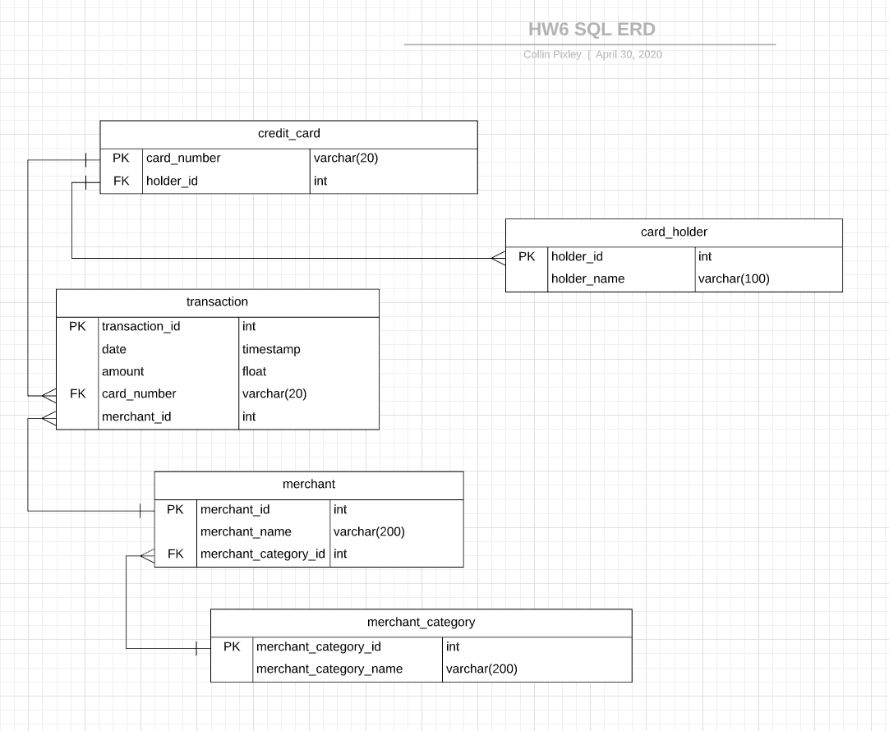

# Create an entity relationship diagram (ERD)

# Database specifics can be found in the DataBase.sql file in this folder

# How can you isolate (or group) the transactions of each cardholder?
select card_holder.holder_name,
round(cast(sum("transaction".amount) as numeric),2) as totalsum
from card_holder
inner join credit_card 
on card_holder.holder_id = credit_card.holder_id
inner join "transaction" 
on credit_card.card_number = "transaction".card_number
group by card_holder.holder_name
order by totalsum asc;

## Consider the time period 7:00 a.m. to 9:00 a.m
select ch.holder_name card_holder, t.date, t.amount
from "transaction" t
join credit_card cc
on t.card_number = cc.card_number
join card_holder ch
on cc.holder_id = ch.holder_id
where extract(hour from t.date) between 7 and 8;

## What are the 100 highest transactions during this time period?
select ch.holder_name card_holder, t.date, 
round(cast(t.amount as numeric),2) as amount
from "transaction" t
join credit_card cc
on t.card_number = cc.card_number
join card_holder ch
on cc.holder_id = ch.holder_id
where extract(hour from t.date) between 7 and 8
order by t.amount desc
limit 100;

## Do you see any fraudulent or anomalous transactions?
I noticed several large transactions above the typical amount as can be found in the first 10 rows from the code above. For these to all be made between 7 and 9am, it could use a close eye moving forward

# Some fraudsters hack a credit card by making several small payments (generally less than  2.00) 
select count(*) from transaction --3500
where transaction.amount <= 2 --353

## What are the top five merchants prone to being hacked using small transactions?
select 'merchant_name', count (*) from transaction t
inner join merchant m
on m.merchant_id = t.merchant_id
where t.amount <= 2
group by merchant_name
having count(*) >= 5
order by count(*) desc;

# Once you have a query that can be reused, create a view for each of the previous queries

## Create view for at risk merchants
create view at_risk_merchants as
select merchant_name, count(*) from transaction t
inner join merchant m
on m.merchant_id = t.merchant_id
where t.amount <= 2
group by merchant_name
having count(*) >= 5;

## create view for most expensive purchases
create view most_expensive as
select ch.holder_name card_holder, t.date, 
round(cast(t.amount as numeric),2) as amount
from transaction t
join credit_card cc
on t.card_number = cc.card_number
join card_holder ch
on cc.holder_id = ch.holder_id
where extract(hour from t.date) between 7 and 8;

# Question 1 Queries
select count(*) as count, ch.holder_id, extract("month" from t.date) as month from card_holder ch
inner join credit_card cc 
on cc.holder_id = ch.holder_id
inner join transaction t
on cc.card_number = t.card_number
where ch.holder_id = 2 or ch.holder_id = 18
group by month, ch.holder_name, ch.holder_id
order by month asc;

## Conclusions for Question 1

# Question 2 Queries

## Conclusions for Question 2