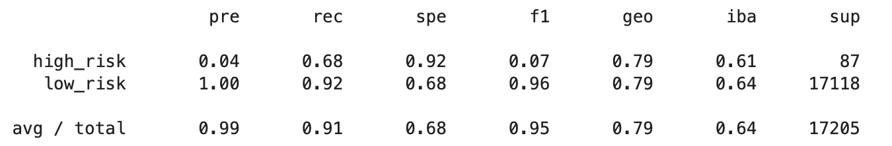
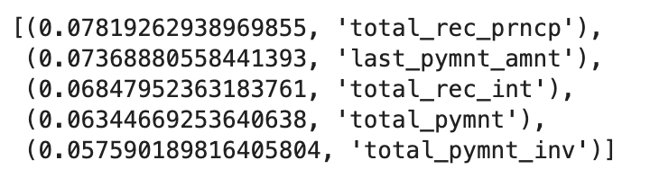
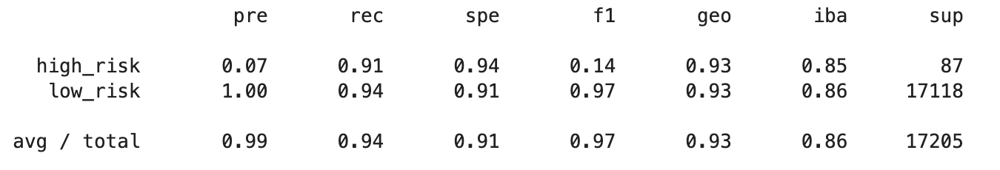
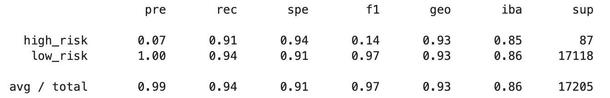
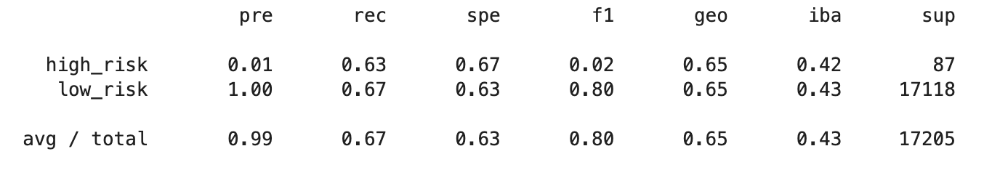
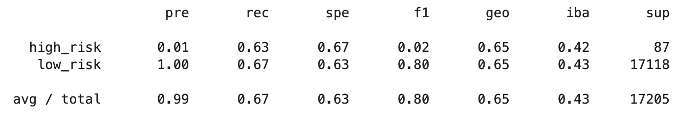
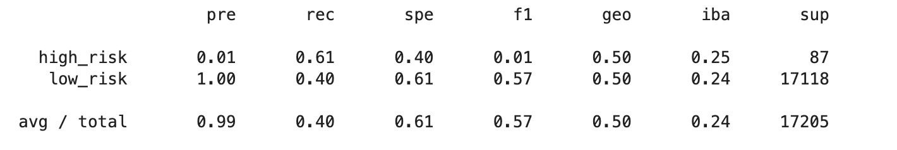
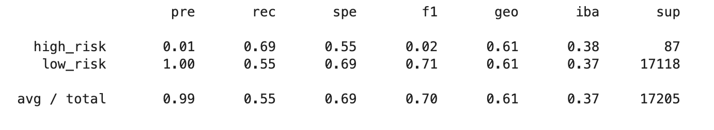

# Classification/Machine Learning Homework

## Credit Risk Ensemble

### Balanced Random Forest
* Accuracy Score: 0.9959895379250218
#### Random Forest Imbalanced Classification Report:

#### Important Features:

### Easy Ensemble AdaBoost
* Accuracy Score : 0.925427358175101
#### Easy Enseble AdaBoost Imbalanced Classification Report:

### Gradient Boost
* Accuracy Score : 0.9957570473699506
#### Gradient Boost Imbalanced Classification Report:

## Analysis of Methods:
* The Balanced Random Forest accuracy score outcompeted the Easy Ensemble AdaBoost and Gradient Boost models.

----------------------------------

## Credit Risk Resampling

### Naive Random Oversampling
* Accuracy Score: 0.6533977140416822
#### Oversample Imbalanced Classification Report:

### SMOTE Oversampling
* Accuracy Score: 0.6533977140416822
#### SMOTE Imbalanced Classification Report:

### Undersampling
* Accuracy Score: 0.6533977140416822
#### Undersample Imbalanced Classification Report:

### Combination
* Accuracy Score: 0.5062567734709582
#### Combination Imbalanced Classification Report:

## Analysis on Methods:
* The worst accuracy score was from the combination method.

